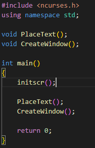
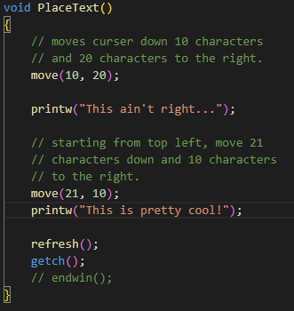

# NCurses

## What is NCurses?
### NCurses is a clone of the original System V Release 4.0 (SVr4) curses.   The name Curses was used in place of "Cursor Optimization" and NCurses stands for "New Curses".

## History/Background
### Back in the good ole days if you wanted a terminal (computer) to perform a specific task, such as print a line of text, you would need to use escape sequences.  
### These sequences are special charcter codes that allow a terminal to perform certain actions. Of course as time went on, different terminals would require different characters codes to interact with it.  
### With this, the designers of UNIX invented the 'termcap' conecpt which later became 'terminfo'. It is a file that provides all of the capabilities that a terminal may have, as well as the escape sequences required to trigger these effects.  

## Where does NCurses fit into this?
### The original Curses library is essentially a wrapper that prevents someone from having to deal with raw terminal codes. Now although NCurses is a clone of the original Curses library, it also provides a framework to create better looking Text-based User Interfaces (TUIs).
### A few examples of NCurses's capabilites include moving the cursor to any point in the terminal, changing the color of the text and background, and handling events for mouse interaction.

## Alternatives
### Final Cut
### Offers the same functionality as NCurses with some differences being Final Cut was written in C++ while NCurses was written in C, and NCurses is still more popular than Final Cut as of recently.

### 
&nbsp;

# My Experience with NCurses
## NCurses (New Curses) vs PDCurses (Public Domain Curses)
### Both of them are continuations of curses, and offer ports to Windows systems. However, I've read online that NCurses is more stable, more user friendly, and offers functionality such as menu and form support whereas PDCurses does not. 
## Windows Subsystem for Linux (WSL)
### Before I realized that there was a port developed for NCurses to Windows and MinGW32, I figured NCurses was only available on Linux systems.   
### To use NCurses this way, I had to install WSL in order to use it since I don't own any hardware running a Linux system.  
### The distribution I used was Ubuntu 22.04.2 LTS which was availble in the Microsoft Store.

<!-- ## How to Install NCurses
### Step 1: -->

### 
&nbsp;

# Example Code
### Hello World Code

### Result

### Bordered Window Code

### Result

# Applications built using NCurses
<!-- Source -->
<!-- https://htop.dev/images/htop-2.0.png -->
### htop (Interactive Process Viewer for Linux)

### Nano (Text Editor for Linux Terminals)

<!-- Source -->
<!-- https://www.youtube.com/watch?v=YgNVkB8cI80 -->
<!-- Allows user to place windows wherever they want. -->
### NetHack (NCurses Interface Version)

<!-- Source -->
<!-- https://www.youtube.com/watch?v=LgvLfR2zG3g&list=PLTTuTDBxpjWjnSc316lTqKRyUuN1yu1uM&index=15&t=1s -->
<!-- Creates own graphics library to visualize a 3D game using NCurses to place pixels anywhere in terminal. -->
### 3D Terminal Game (by KayOS Code on YouTube)
