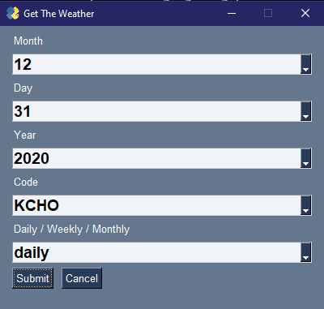
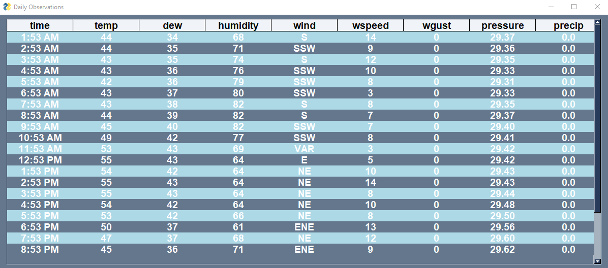
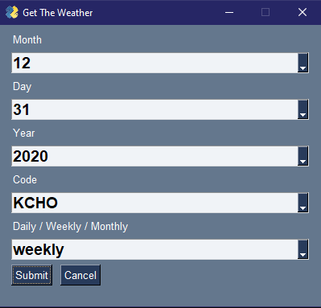
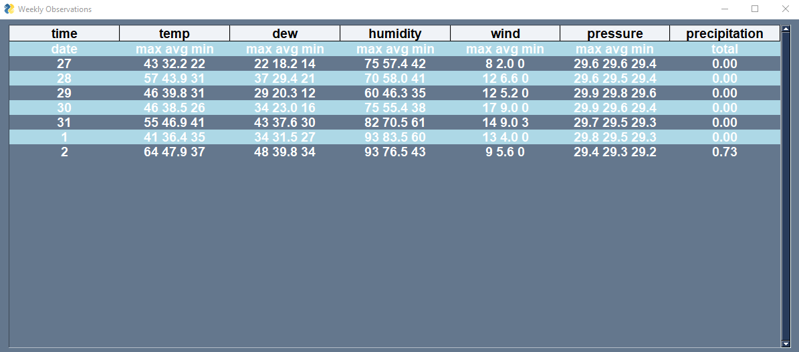
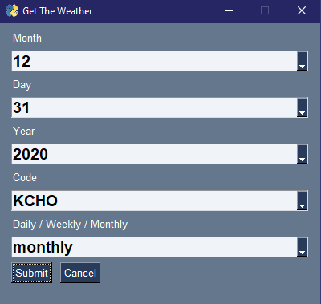
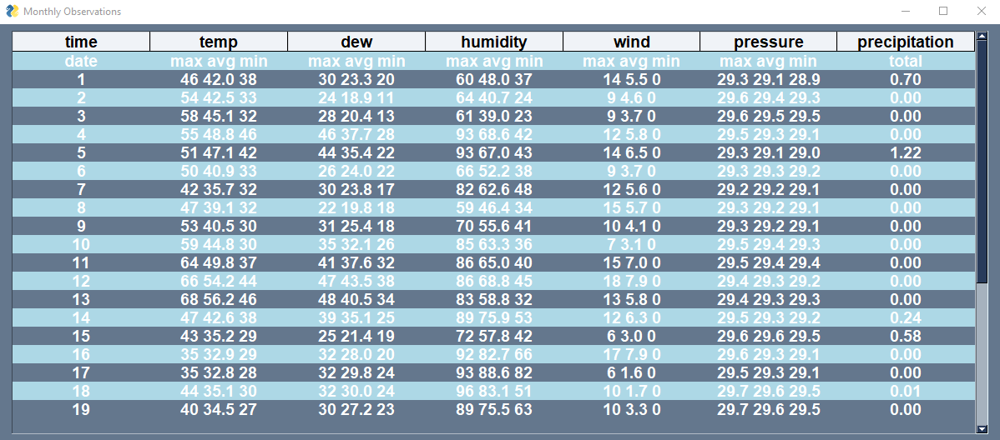

##  Assignment 7 - Web Scraping
### Kolten Pulliam

## Description
### This program allows a user to input a day, month, and year to view the weather data of that day. The user can also specify a filter to apply to the data such as daily, weekly, or monthly. All of the data comes from wunderground.com.

| Link                                                                                                          | Assignment Description           |
| ------------------------------------------------------------------------------------------------------------- | -------------------------------- |
| [main.py](https://github.com/klpulliam-37/4883-SoftwareTools-Pulliam/tree/main/Assignments/A07/main.py)       | Main python script               |
| [gui.py](https://github.com/klpulliam-37/4883-SoftwareTools-Pulliam/tree/main/Assignments/A07/gui.py)         | Creates gui for user interaction |
| [extract.py](https://github.com/klpulliam-37/4883-SoftwareTools-Pulliam/tree/main/Assignments/A07/extract.py) | Beautiful Soup and Selenium      |
| [codes.py](https://github.com/klpulliam-37/4883-SoftwareTools-Pulliam/tree/main/Assignments/A07/codes.py)     | Generates airport code list      |

## Example URL's
### Daily Query

### Daily Results

### Weekly Query

### Weekly Results

### Monthly Query

### Monthly Results
